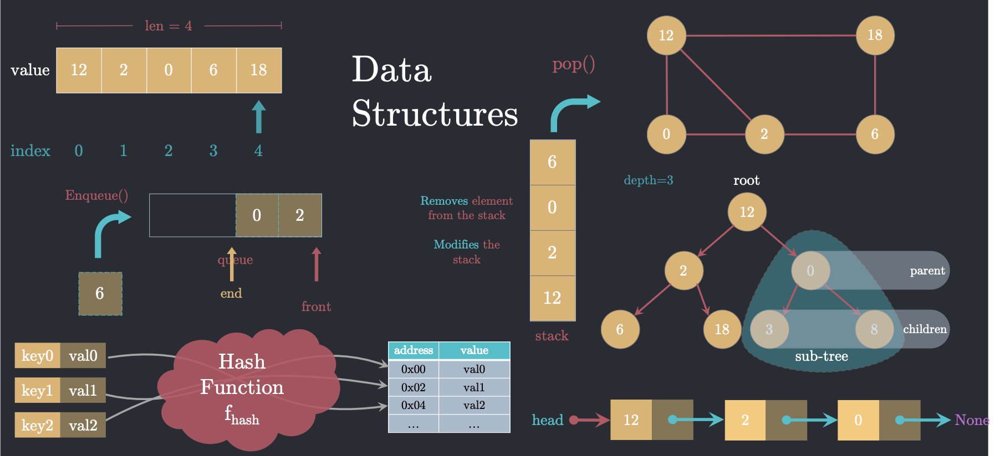

# DSA Course
-  This repo contains of the time complexity for all algorithms 
-  open your TERMINAL on dist folder and write ```node <fileName>.js``` to see output
-  Egn/Mostapha Taha ```Stockfish```
-  
    <a href="https://leetcode.com/M0staphaTaha/">My account on leetcode</a>
